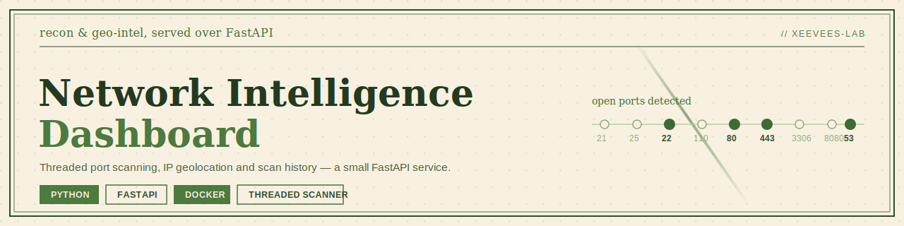
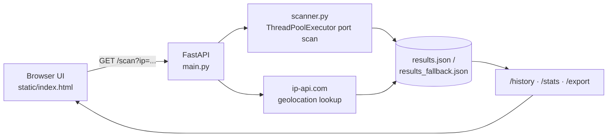

<p align="center">
  
</p>

<p align="center">
  
  
  
  
  
  
</p>

A small full-stack tool for reconnaissance on a single host: it TCP-scans a port range, geolocates the IP, and keeps a running history you can query or export. Backend is FastAPI, the scanner is a plain `socket` + `ThreadPoolExecutor` (no nmap dependency), and the frontend is a single static HTML page — no build step.

## Features

- **Threaded port scan** — checks a configurable port range (default `1–1024`) concurrently, up to 100 worker threads at once
- **IP geolocation** — country, city, ISP, lat/lon, and timezone for the scanned IP, via [ip-api.com](https://ip-api.com)
- **Scan history** — every scan is appended to `results.json`; if that path isn't writable, it falls back to `results_fallback.json` automatically
- **Aggregate stats** — total scans, most frequently open ports, and the set of countries scanned, in one endpoint
- **CSV export** — download the full scan history as a `.csv`
- **Zero-build frontend** — one static HTML file, vanilla JS, no npm install
- **Dockerized** — `docker-compose up` and it's running

## How it works



## Tech stack

| Layer | Tools |
|---|---|
| Backend | FastAPI, Uvicorn, Pydantic |
| Scanning | Python `socket`, `ThreadPoolExecutor` |
| Geolocation | ip-api.com (REST) |
| Frontend | HTML, CSS, vanilla JS |
| Storage | Flat-file JSON (with fallback path) |
| Deployment | Docker, docker-compose |

## API reference

| Method | Endpoint | Params | Description |
|---|---|---|---|
| `GET` | `/` | — | Serves the dashboard UI |
| `GET` | `/health` | — | Health check |
| `GET` | `/scan` | `ip`, `start_port` (default `1`), `end_port` (default `1024`) | Runs a scan and geolocation lookup, saves the result |
| `GET` | `/history` | — | Returns all past scan results |
| `GET` | `/stats` | — | Aggregate stats: total scans, top open ports, countries scanned |
| `GET` | `/export` | — | Downloads scan history as CSV |

## Getting started

### Prerequisites
- Python 3.11+
- or Docker + docker-compose

### Run locally

```bash
git clone https://github.com/xeevees-lab/network-intelligence-dashboard.git
cd network-intelligence-dashboard
python -m venv venv
source venv/bin/activate        # Windows: venv\Scripts\activate
pip install -r requirements.txt
uvicorn main:app --reload
```

Visit `http://localhost:8000`.

### Run with Docker

```bash
docker-compose up --build
```

This maps the container's port `8000` to host port `8080`. Note that `static/index.html` currently calls the API at a hardcoded `http://localhost:8000` — if you're serving through the Docker mapping, either hit the API on `8000` directly or update the `API` constant in `static/index.html` to match your port.

## Usage

```bash
# Scan a host
curl "http://localhost:8000/scan?ip=8.8.8.8&start_port=1&end_port=1024"

# Aggregate stats
curl http://localhost:8000/stats

# Export history as CSV
curl http://localhost:8000/export -o scan_history.csv
```

## Project structure

```
network-intelligence-dashboard/
├── main.py                 # FastAPI app, routes, history persistence
├── scanner.py               # Port scanning + geolocation logic
├── static/
│   └── index.html            # Dashboard UI (vanilla JS)
├── assets/
│   └── banner.svg
├── results_fallback.json     # Used if the primary results path isn't writable
├── requirements.txt
├── Dockerfile
├── docker-compose.yml
└── LICENSE
```

## Roadmap

Not yet implemented — noting these here so the repo doesn't overstate where it's at:

- [ ] Async scanning (`asyncio`) instead of one thread per port
- [ ] Auth / rate limiting before exposing this beyond localhost
- [ ] SQLite (or Postgres) instead of flat-file JSON for history
- [ ] Caching for geolocation lookups to avoid hitting ip-api.com's rate limit
- [ ] A basic `pytest` suite

## Responsible use

This tool scans real ports on real hosts. Only point it at IPs and networks you own or have explicit authorization to test.

## License

[MIT](LICENSE) © 2026 Veenus Patil

---

<p align="center">
  <a href="https://github.com/xeevees-lab">GitHub</a> ·
  <a href="https://www.linkedin.com/in/veenus-patil">LinkedIn</a>
</p>
